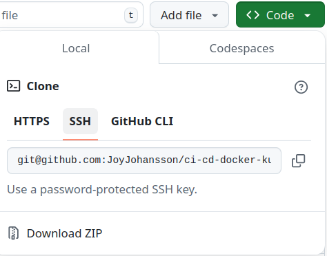
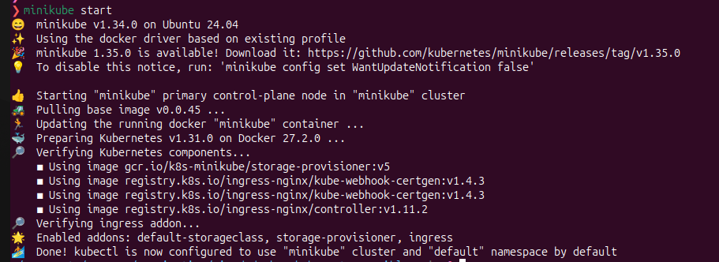
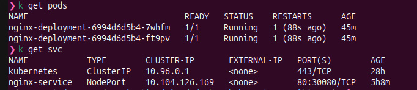
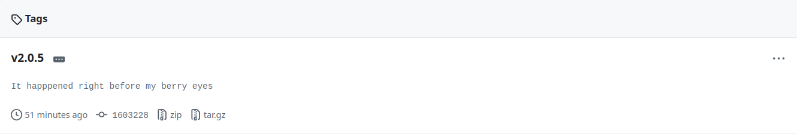
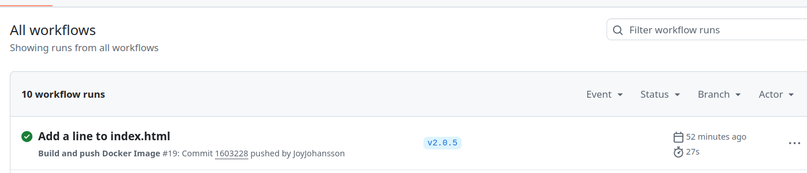
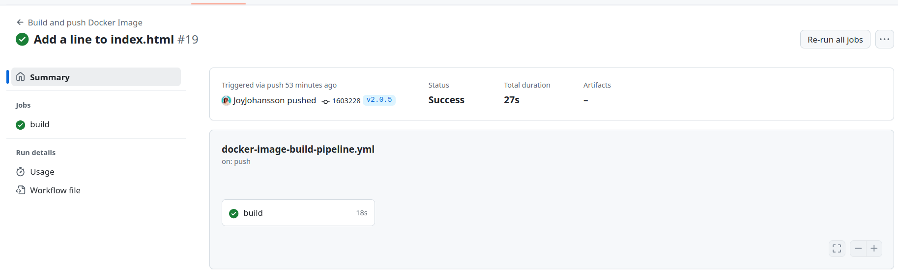
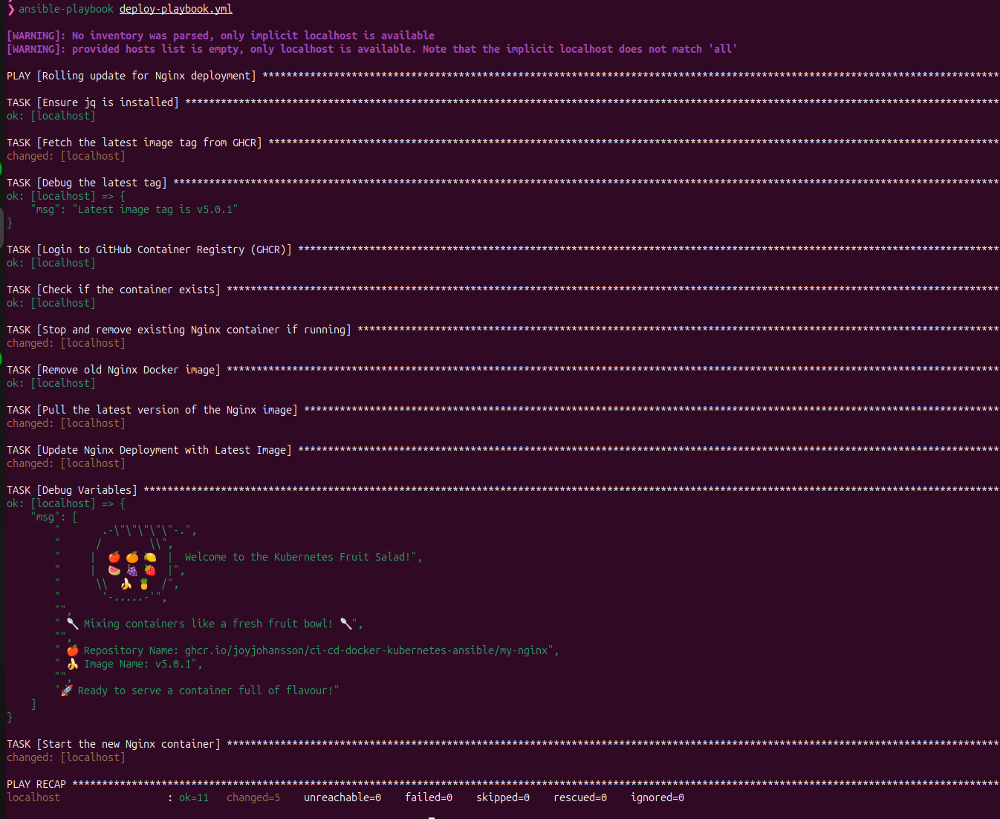
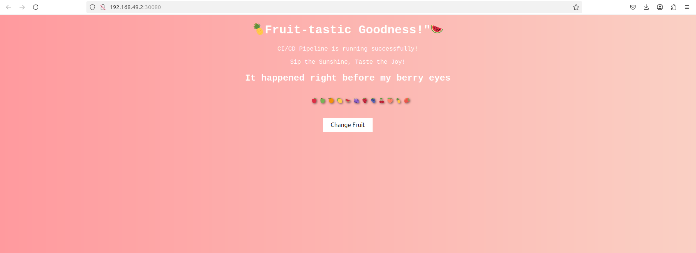

# CI/CD with Docker, Kubernetes, and Ansible


## Introduction
This project demonstrates a fully automated **CI/CD pipeline** using **Docker, Kubernetes, and Ansible**. The pipeline builds and deploys an **Nginx web server** with a custom `index.html`, ensuring automated versioning and rolling updates.

The workflow is managed via **GitHub Actions**, pushing built images to **GitHub Container Registry (GHCR)** and deploying them using Kubernetes. **Ansible** is used to handle rolling updates with rollback capabilities.

---

## Prerequisites
Before starting, ensure you have the following installed:
- **Git** - To clone and manage the repository.
- **Docker** - To build and push images.
- **Minikube** - To run Kubernetes locally.
- **Kubectl** - To interact with the Kubernetes cluster.
- **Ansible** - To manage deployments.
- **A GitHub Personal Access Token (PAT)** with permissions to push to **GHCR**.

Install the necessary tools using:
```sh
sudo apt update && sudo apt install -y git docker.io kubectl ansible
```

For **Minikube**, follow the [official installation guide](https://minikube.sigs.k8s.io/docs/start/).

---

## Collaborator Guide
This guide ensures a collaborator can:
- Clone the repository and set up **Minikube**
- Deploy **Nginx** with a **NodePort service**
- Modify `index.html`, commit & push with a **semantic version tag**
- Trigger a **GitHub Actions pipeline** to build and push an image to **GHCR**
- Manually update the **Ansible playbook** with the new image version
- Run **Ansible** to update deployment, validate success, or rollback on failure
- Allow the **examiner** to test the Minikube deployment

---

## Steps to Follow

### **1. Clone the Repository**
```sh
git clone https://github.com/JoyJohansson/ci-cd-docker-kubernetes-ansible.git
cd ci-cd-docker-kubernetes-ansible
```



## **2. Set Up GHCR Authentication**

Before pushing or pulling images from GitHub Container Registry (GHCR), a collaborator must create and configure authentication secrets for GitHub Actions and Kubernetes.
### Create a GitHub Personal Access Token (PAT)

    Go to GitHub → Settings → Developer Settings → Personal Access Tokens
    Click "Generate new token (classic)"
    Set permissions:
        write:packages (to push images)
        read:packages (to pull images)
        repo (to allow GitHub Actions access)
    Copy the generated token (you won’t be able to see it again).

### Store PAT as a GitHub Actions Secret

    Go to the GitHub repository
    Navigate to Settings → Secrets and variables → Actions → New Repository Secret
    Create a new secret:
        Name: GHCR_PAT
        Value: Paste your Personal Access Token (PAT)

### Create a Kubernetes Secret for GHCR

After setting up authentication in GitHub, you need to create a Kubernetes secret to allow your cluster to pull images from GHCR.

```sh
kubectl create secret docker-registry ghcr-secret \
  --docker-server=ghcr.io \
  --docker-username=GITHUB_USERNAME \
  --docker-password=YOUR_PAT_TOKEN \
  --docker-email=YOUR_EMAIL
```

 - Replace GITHUB_USERNAME, YOUR_PAT_TOKEN, and YOUR_EMAIL with your actual details.
### 2.4 Attach the Secret to Kubernetes Deployment

Edit your nginx-deployment.yml file to use imagePullSecrets:

```sh
spec:
  imagePullSecrets:
    - name: ghcr-secret
```

Now, Kubernetes can authenticate with GHCR and pull images securely.

### **3. Deploy Nginx in Minikube**
**Start Minikube:**
```sh
minikube start
```


**Deploy Nginx with a NodePort service:**
```sh
kubectl apply -f nginx-deployment.yml
kubectl apply -f nginx-service.yml
```

**Verify deployment:**
```sh
kubectl get pods
kubectl get svc
```



---

### **4. Modify index.html, Commit, and Push a Versioned Tag**

**Update `index.html` and commit:**
```sh
echo "<h3>If you want a dressing, LETTUES know!</h3>" > index.html
git add index.html
git commit -m "Update index.html with a new message"
```

**Tag with semantic versioning (e.g., v3.0.0):**
```sh
git tag v3.0.0
git push origin v3.0.0
```

**This triggers the GitHub Actions pipeline!**





---

## GitHub Actions Pipeline: Build & Push Image to GHCR
The pipeline automatically:
- Builds the updated Docker image
- Tags it with `v3.0.0`
- Pushes it to **GHCR**





## Update your Deployment - force rollout restart
Update your Nginx deployment in Kubernetes after pushing a new image, you need to force a rollout restart so that Kubernetes pulls the latest version of the container

```sh
kubectl rollout restart deployment nginx-deployment
```

---

### **5. Run Ansible Playbook to Update the Deployment**
**Execute the playbook:**

```sh
ansible-playbook deploy-playbook.yml --ask-become-pass
```
- Updates the deployment with the new **GHCR image**
- Waits for **Kubernetes rollout completion**
- Validates that **all pods are running**
- **Rolls back** if deployment fails
  


---

## Validation with Minikube
Runs:
```sh
minikube service nginx-service
```
This should open the **updated index.html** in a browser.





This fully automated pipeline ensures seamless deployment, updates, and validation with CI/CD, GitHub Actions, GHCR, Kubernetes, and Ansible.

- Now, the pipeline is fully automated!
- The collaborator can deploy, update, and validate everything end-to-end!
- Let me know what further refinements could be made!


 
 ### **From code to production—one commit at a time!** ###
